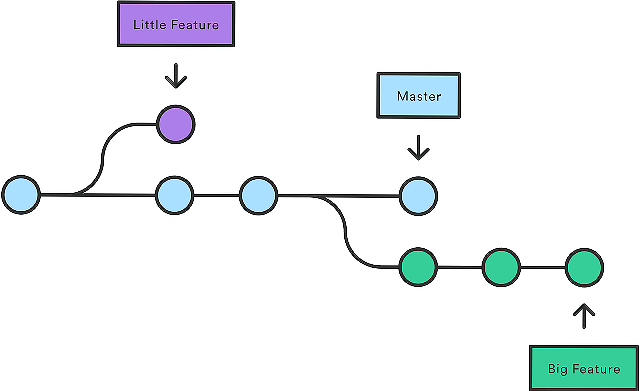

[< к Cодержанию>](./readme.md)


+ Команда 
```
$ git branch
```
Список именованных веток коммитов с указанием выбранной ветки




+ Команда 
```
$ git branch [имя ветки]
```
Создаёт новую ветку
+ Команда 
```
$ git checkout [имя ветки]
```
Переключается на выбранную ветку и обновляет рабочую директорию до её состояния
+ Команда 
```
$ git merge [имя ветки]
```
Вносит изменения указанной ветки в текущую ветку
+ Команда 
```
$ git branch -d [имя ветки]
```
Удаляет выбранную ветку

> просмотр веток
`
git branch -v
`

> просмотр всех веток вместе с удаленными
 `git branch -a`

>просмотр только удаленных веток 
`git branch -r`

>совместный просмотр и локальных и удаленных веток с подробной информацией 
`git branch -avv`

***

### ***Следующий шаг [Синхронизация с удаленным репозиторием git push](./gitpush.md)***