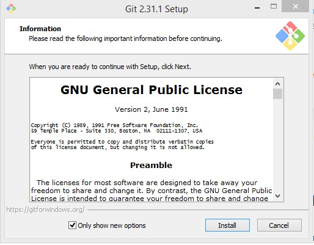

[< к Cодержанию>](./readme.md)
## Установка GIT
+ Переходим по [ссылке](https://git-scm.com/). Скачиваем установочный файл **Download version for Windows**
+ Запускаем загруженный файл, проходим шаги установки.

  

+ Запускаем установленный файл ***Git Bash***

+ Устанавливает имя, которое будет отображаться в поле автора у выполняемых вами коммитов

```bash=
git config --global user.name "[имя]"
```
+ Устанавливает адрес электронной почты, который будет отображаться в информации о выполняемых вами коммитах

 ```
 git config --global user.email "[адрес электронной почты]"
 ```

 
***

### ***Следующий шаг [Подготовка, создание репозитория](./create_repozit.md)***